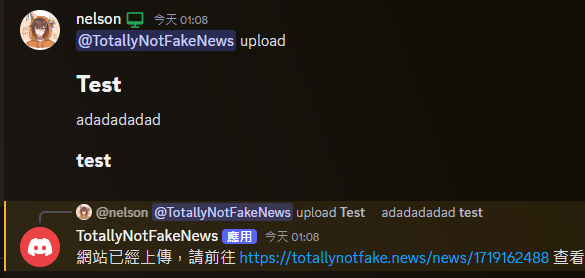
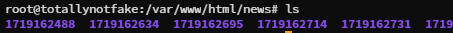

# totallynotfake.news-bot

The discord bot for totallynotfake.news

# Showcase

result: https://totallynotfake.news/news/1719162488/

# How it works

It generates a folder comes with a index.html file at the path of you provided, with installing of nginx or apache, it allows others to view the page.

# Usage

1. install python3, nginx or apache
2. install discord.py
3. setup the nginx or apache web server
4. fill in the token, URL and file path
5. run bot.py

# Note

The index.html is provided in the file. You can use it as the "/" page.
